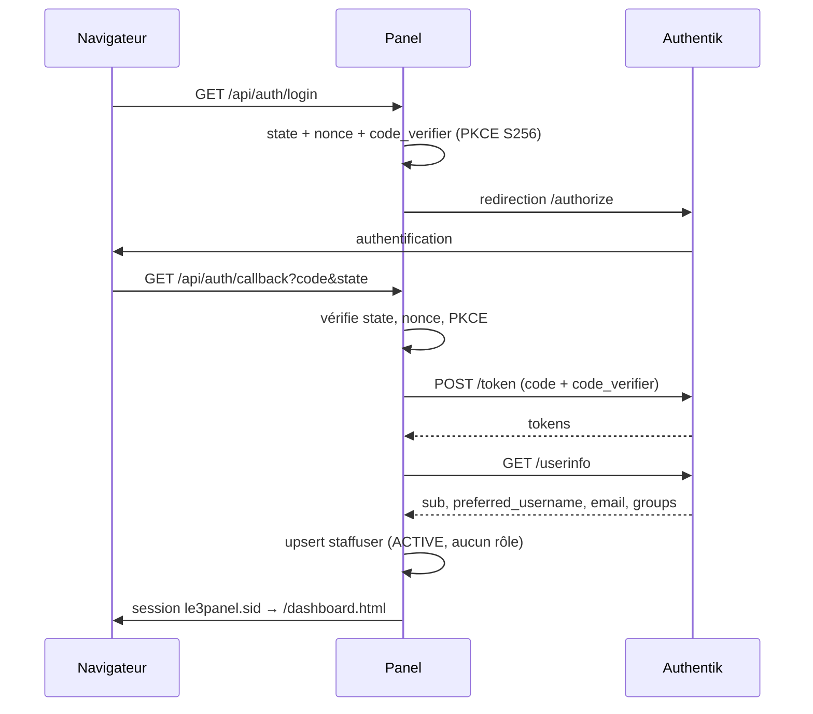

# Authentification et Sessions

L'écosystème utilise **deux domaines d'authentification totalement séparés** : les joueurs d'un
côté, le staff de l'autre. Ils ne partagent ni base de comptes, ni cookie, ni préfixe de session.

| | Joueurs (Core + Live) | Staff (Panel) |
| :--- | :--- | :--- |
| Fournisseur | Microsoft, Discord, Twitch, compte local | **Authentik** (OIDC) |
| Base de comptes | `users` (MongoDB Core) | `staffusers` (MongoDB Panel) |
| Cookie | `3levent.sid` sur `.3levent.fr` | `le3panel.sid` |
| Préfixe Redis | `le3:sess:` | `le3panel:sess:` |
| Durée | 7 jours, glissante | 8 heures, glissante |
| Mots de passe stockés | oui (`bcryptjs`) si pas d'OAuth | **jamais** |
| Autorisation | rôle (`authorize`) | permissions (`requirePermission`) |

---

## 1. Session partagée Core ↔ Live

Le Core et le Live utilisent **la même session** : mêmes `secret`, même nom de cookie
`3levent.sid`, même préfixe Redis `le3:sess:`, cookie posé sur le domaine
`LE3_COOKIE_DOMAIN` (`.3levent.fr` par défaut). Un joueur connecté sur `3levent.fr` est donc
authentifié sur `live.3levent.fr` sans redirection.

```ts
store: new RedisStore({ client: redisClient, prefix: 'le3:sess:', ttl: 60 * 60 * 24 * 7 }),
cookie: {
    domain: isProduction ? (process.env.LE3_COOKIE_DOMAIN || '.3levent.fr') : undefined,
    httpOnly: true,
    secure: isProduction,
    sameSite: 'lax',
    maxAge: 1000 * 60 * 60 * 24 * 7
}
```

:::danger Ces trois valeurs sont solidaires
`LE3_SESSION_SECRET`, le nom du cookie et le préfixe Redis doivent être **identiques** dans
`3levent` et `3levent-live`. Toute divergence déconnecte silencieusement les joueurs en passant
d'un sous-domaine à l'autre.
:::

Un middleware d'hydratation recopie `req.session.user` dans `req.user` sur chaque requête, de sorte
que les contrôleurs n'aient jamais à connaître la mécanique de session.

---

## 2. Authentification des joueurs (Core)

### Fournisseurs

| Route | Rôle |
| :--- | :--- |
| `GET /api/auth/microsoft/login` · `/callback` | **Connexion principale** : chaîne Microsoft → Xbox Live → XSTS → profil Minecraft. Prouve la possession du compte et fournit `mc_uuid` / `mc_ign`. |
| `GET /api/auth/discord/login` · `/callback` | Liaison Discord (session requise) |
| `GET /api/auth/twitch/login` · `/callback` | Liaison Twitch (session requise) |
| `DELETE /api/auth/discord/unlink` · `/twitch/unlink` | Déliaison |
| `GET /api/auth/me` · `/logout` | Session courante, déconnexion |

Le portail d'inscription (`/api/portal`) rejoue ses propres flux Discord et Microsoft, et ajoute un
mécanisme d'**OTP** (`POST /api/portal/otp/create`) stocké haché dans `verifications`, avec date
d'expiration et `used_at`.

Un couple `POST /api/users/register` / `POST /api/users/login` avec mot de passe `bcryptjs` reste
disponible : dans `users`, `password` n'est requis que si aucun fournisseur OAuth n'est lié.

### Middleware

* `requireAuth` (`utils/helpers.ts`) : garde simple basée sur la session.
* `protect` (`middleware/auth.ts`) : garde **hybride**. Elle accepte la session, et à défaut un
  `Authorization: Bearer <jwt>` vérifié avec `LE3_JWT_SECRET`.
* `authorize('STAFF', 'ADMIN')` : contrôle de rôle, renvoie `403` avec la liste des rôles requis.

Le gating des pages HTML est fait dans `server.ts` : `/admin` exige un rôle `STAFF` ou `ADMIN`,
`/forum/create` exige une session, `/login` redirige vers `/profile` si déjà connecté.

---

## 3. Authentification du staff (Panel, Authentik)

Le panel **ne stocke aucun mot de passe**. Toute l'authentification est déléguée à l'instance
Authentik auto-hébergée (`sso.3levent.fr`) en **OpenID Connect, Authorization Code + PKCE S256**.



Les endpoints ne sont pas codés en dur : ils sont résolus depuis
`<issuer>/.well-known/openid-configuration`. L'issuer doit se terminer par un slash.

### Création de compte et attribution des droits

À la première connexion, le compte est créé avec le statut `ACTIVE` et **aucun rôle**, donc aucune
permission : le membre ne voit que sa page de profil. Un administrateur lui attribue ensuite un
rôle depuis la page IAM.

L'identité (pseudo, nom affiché, e-mail, groupes) appartient à Authentik et est **resynchronisée à
chaque connexion** : elle est en lecture seule dans le panel. La déconnexion ferme aussi la session
Authentik (*RP-initiated logout*).

### Amorçage du premier administrateur

Sur une base neuve, personne n'a de rôle, donc personne ne peut en attribuer.
`LE3_BOOTSTRAP_SUPER_ADMIN` (pseudos ou e-mails Authentik séparés par des virgules) promeut ces
comptes `super-admin` **tant qu'ils n'ont aucun rôle**. Videz la variable une fois les vrais
administrateurs en place.

### Bypass de développement

`GET /api/auth/dev-login` ouvre une session `SUPER_ADMIN` locale sans Authentik. Il exige les
**deux** conditions simultanément : `NODE_ENV !== 'production'` **et** `LE3_DEV_AUTH_BYPASS=true`.

---

## 4. Modèle d'autorisation du Panel (RBAC)

Le panel ne raisonne pas en rôles Discord ni en groupes Authentik : les rôles sont des entités
propres au panel.

```text
Groupes d'accès (interface admin)  →  Permissions (appliquées par le code)  →  Rôle → Membre
```

### Permissions internes

`VIEW_DASHBOARD`, `VIEW_LOGS`, `MANAGE_ACHIEVEMENTS`, `MANAGE_DATABASE`, `MANAGE_CMS`,
`MANAGE_WEBHOOKS`, `MANAGE_IAM`, `ACCESS_DOCKER`, `ACCESS_PTERODACTYL`, `SUPER_ADMIN`.

Elles ne sont **pas** exposées dans l'interface : elles sont dérivées des groupes d'accès.

### Groupes d'accès (`ACCESS_GROUP_CATALOGUE`)

| Groupe | Libellé | Permissions accordées |
| :--- | :--- | :--- |
| `MONITORING` | Monitoring & Serveur | `VIEW_DASHBOARD`, `VIEW_LOGS`, `ACCESS_DOCKER`, `ACCESS_PTERODACTYL` |
| `IN_GAME` | Gestion In-Game | `MANAGE_ACHIEVEMENTS` |
| `DATABASE` | Base de données | `MANAGE_DATABASE` |
| `SITE_CONFIG` | Configuration du site | `MANAGE_CMS` |
| `ADMINISTRATION` | Administration (IAM) | `MANAGE_IAM` |
| `SUPER_ADMIN` | Super Admin | `SUPER_ADMIN` (accès total) |

`permissionsForGroups()` développe les groupes en permissions ; le résultat est **caché** sur le
rôle (`panelroles.permissions`) puis sur le membre (`staffusers.permissions`), afin que le
middleware et la session n'aient aucune jointure à faire.

### Application

```ts
router.get('/tables', requireAuth, requirePermission('MANAGE_DATABASE'), listTables);
```

`requirePermission` accorde l'accès si le membre possède **au moins une** des permissions
demandées, ou `SUPER_ADMIN`. Un `403` renvoie explicitement la liste des permissions attendues.

### Défense en profondeur

1. **Pages** : les routes HTML privées sont déclarées **avant** `express.static`, pour qu'un
   fichier HTML privé ne puisse jamais être servi à un visiteur non authentifié.
2. **Navigation** : le frontend masque les onglets auxquels le membre n'a pas droit — confort,
   pas sécurité.
3. **API** : chaque route re-vérifie la permission côté serveur. C'est la seule barrière qui
   compte.

---

### Prochaines étapes

* **[Staff Panel](../projects/staff-panel)**
* **[Gestion des secrets](../infrastructure/secrets-management)**
* **[Protocoles de communication](./communication-protocol)**
