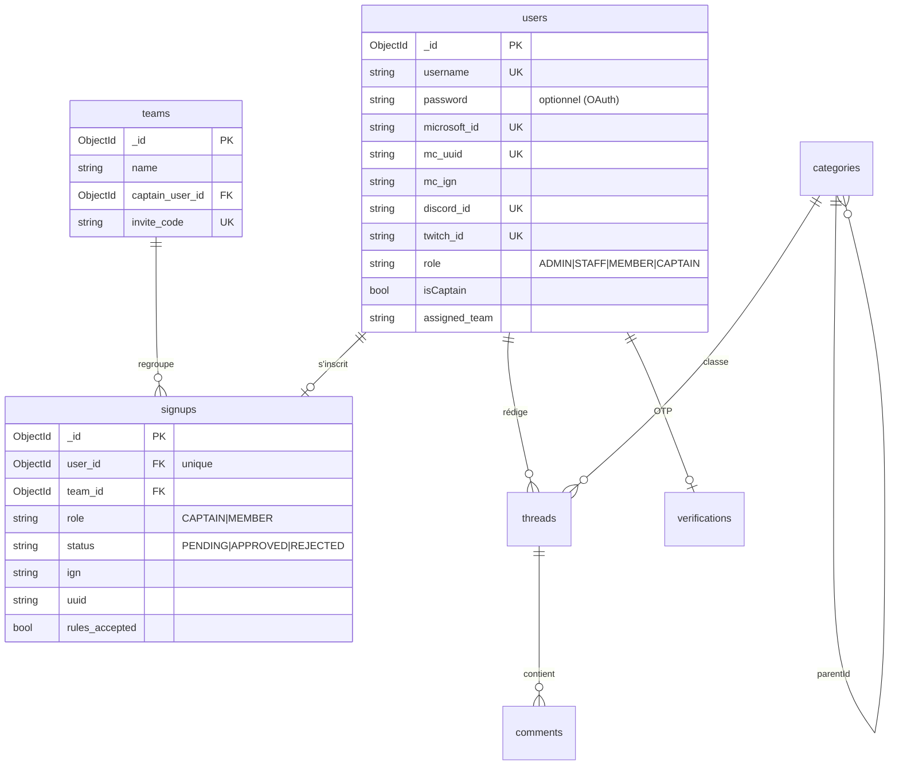

# Schéma des Données

L'écosystème **3LEvent** ne possède pas une base unique, mais **cinq espaces de stockage** aux
responsabilités strictement séparées : trois bases MongoDB (une par application web), une base
MySQL appartenant au plugin Minecraft, et Redis.

---

## 1. Cartographie

| Stockage | Propriétaire | Contenu | Accès externe |
| :--- | :--- | :--- | :--- |
| **MongoDB Core** | `3levent` | Comptes, forum, inscriptions, journal du bus | aucun |
| **MongoDB Live** | `3levent-live` | Read-model temps réel, pronostics | aucun |
| **MongoDB Panel** | `3levent-panel` | Staff, rôles, logs, métriques, config, audit | aucun |
| **MySQL** | `LE3-Plugin-Core` | Points et progression des succès | Panel (éditeur audité) |
| **Redis** | partagé | Sessions, bus d'événements, drapeaux | tous |

:::warning Une seule base est partagée
La base MySQL est la **seule** que deux services ouvrent : le plugin (propriétaire, qui crée les
tables) et le panel (éditeur en liste blanche). Aucune base MongoDB n'est partagée entre services.
:::

---

## 2. Conventions

### MongoDB / Mongoose

* Les noms de collections sont ceux que **Mongoose dérive automatiquement** du nom de modèle
  (minuscules + pluriel) : `User` → `users`, `PanelRole` → `panelroles`. Aucun modèle ne force
  `collection:`.
* Champs en `snake_case` pour les données métier et les clés étrangères (`team_id`, `mc_uuid`,
  `authentik_sub`). Quelques champs de présentation historiques restent en `camelCase`
  (`isPinned`, `isLocked`, `imageUrl`, `displayOrder`, `parentId`, `isCaptain`) — ne pas propager
  ce style sur les nouveaux champs.
* `timestamps: true` sur la quasi-totalité des schémas ; les journaux n'activent que `createdAt`.
* Les identifiants Minecraft sont des UUID en `String`. Le Live les **normalise** (minuscules,
  tirets retirés) avant écriture.

### MySQL (plugin)

* Tables sans préfixe : `teams`, `team_achievements`, `player_achievements`, `core_settings`.
* Créées par `DatabaseManager.initializeTables()` au démarrage du plugin (`CREATE TABLE IF NOT
  EXISTS`). Il n'y a **pas** de système de migration.
* Le plugin bascule automatiquement sur **SQLite** (`advancementscore.db`) si `database.type`
  n'est pas `mysql` ou si les identifiants manquent — le schéma est identique, la syntaxe d'upsert
  diffère (`ON DUPLICATE KEY UPDATE` vs `ON CONFLICT`).
* Encodage `utf8mb4`.

---

## 3. MongoDB — base Core (`3levent`)



### `users`

Table pivot de l'identité : un compte agrège jusqu'à quatre identités externes.

| Champ | Type | Notes |
| :--- | :--- | :--- |
| `username` | String, unique | Pseudo du site |
| `password` | String | **Requis uniquement** si aucun fournisseur OAuth n'est lié (`bcryptjs`) |
| `microsoft_id` | String, unique sparse | Connexion Microsoft = preuve de possession du compte Minecraft |
| `mc_uuid` / `mc_ign` | String | UUID et pseudo Minecraft, alimentent `sync-teams` |
| `discord_id` / `discord_handle` | String | Liaison Discord |
| `twitch_id` / `twitch_username` | String | Liaison Twitch |
| `role` | Enum | `ADMIN`, `STAFF`, `MEMBER`, `CAPTAIN` (défaut `MEMBER`) |
| `isCaptain` | Boolean | Capitanat tournoi |
| `assigned_team` | Enum | Une des huit équipes prédéfinies, ou `null` |

Les huit équipes prédéfinies sont figées dans le modèle : *Requins Rouges, Bélier Bleus, Ours
Orange, Jaguards Jaunes, Vipères Vertes, Renards Roses, Vautours Violets, Caimans Cyan*.

### `signups`

Inscription à l'événement, **une par utilisateur** (`user_id` unique). Porte `ign` et `uuid`
dénormalisés pour que la synchronisation plugin n'ait pas à peupler `users`.

### `teams`

Équipe du site : `name`, `captain_user_id`, `invite_code` (unique). C'est le `name` qui est
traduit en `slotKey` du plugin par `TEAM_SLOT_MAP`.

### Forum : `categories`, `threads`, `comments`

* `categories` : `name`, `slug` (unique), `description`, `icon` (classe FontAwesome), `parentId`
  (auto-référence pour les sous-catégories), `isStaffOnly`, `displayOrder`.
* `threads` : `title`, `content`, `imageUrl`, `author` → `users`, `category` → `categories`,
  `isPinned`, `isLocked`.
* `comments` : `content`, `author` → `users`, `thread` → `threads`.

### `moderationlogs`

Journal de modération : `admin_id`, `action`, `target_id`, `target_model`
(`User|Thread|Comment|Category|System|Team`), `details`, `reason`, `ip_address`.
`createdAt` seulement.

### `verifications`

OTP de liaison Discord : `user_id` (unique), `otp_hash`, `method` (`DM|SLASH`), `used_at`,
`expires_at`.

### `eventlogs`

Journal du bus d'événements. Un document par enveloppe : `event_id` (unique, clé d'idempotence),
`type`, `version`, `occurred_at`, `source`, `aggregate`, `correlation_id`, `causation_id`,
`payload` (Mixed), `status` (`RECEIVED|PROCESSED|FAILED`), `processed_at`, `error_message`.
Index composé `{ type: 1, occurred_at: -1 }`.

:::note Incohérence connue
Le contrat exporte `EVENT_LOG_COLLECTION = 'event_bus_events'`, mais cette constante **n'est
utilisée nulle part** : le modèle `EventLog` n'impose pas de nom de collection, donc les documents
atterrissent dans `eventlogs`. Si vous inspectez la base, cherchez `eventlogs`.
:::

---

## 4. MongoDB — base Live (`3levent-live`)

Le Live ne lit **jamais** la base du Core ni celle du plugin. Il reconstruit localement un
read-model à partir des événements du bus (`live-event-consumer.ts`).

| Collection | Champs | Alimentée par |
| :--- | :--- | :--- |
| `liveteamstates` | `slot_key` (unique), `name`, `points` | `plugin.teams.snapshot.v1`, `plugin.team.points.updated.v1` |
| `liveplayerachievementstates` | `uuid` (normalisé), `achievement_count` | `plugin.achievement.granted.v1` (`$inc`) |
| `livesettingstates` | `key`, `value` | `plugin.settings.updated.v1` (ex. `hide_scores`) |
| `predictions` | `user_id`, `team_id` | Votes des spectateurs |

Le Live embarque aussi des copies des schémas `User`, `Team` et `Signup` du Core, utilisées en
lecture pour résoudre l'identité d'une session partagée.

---

## 5. MongoDB — base Panel (`3levent-panel`)

| Collection | Rôle | Particularité |
| :--- | :--- | :--- |
| `staffusers` | Comptes staff | Identité **possédée par Authentik** : `authentik_sub` (unique), `username`, `display_name`, `email`, `authentik_groups`, `status`, `role_slug`, `permissions` (cache), liaison Discord facultative. Aucun mot de passe. |
| `panelroles` | Rôles panel | `slug` (unique), `name`, `color`, `priority`, `access_groups`, `permissions` (dérivées et cachées), `is_system` |
| `serverlogs` | Logs serveur | **Capped** 25 Mo / 50 000 documents |
| `servermetrics` | Métriques | **Capped** 15 Mo / 100 000 documents |
| `siteconfigs` | Config du site | `maintenance_main`, `maintenance_live` (+ messages), `hide_scores`, `registrations_open`, `event_name`, `event_tagline`, `updated_by` |
| `dbeditoraudits` | Audit de l'éditeur MySQL | `action` (`INSERT|UPDATE|DELETE`), `table_name`, `record_pk`, `before`, `after`, auteur |
| `teamcaches` | Cache équipes | `slot_key` (unique), `name`, `points`, `member_count`, `lp_group` |
| `teamachievementprogresses` | Cache progression | `team_id`, `achievement_id`, `progress`, `threshold`, `completed` |
| `resourcelinks` | Hub de ressources | `kind` (`RESOURCE|TOOL`), `required_roles`, `display_order` |
| `webhooks` | Webhooks sortants | `url`, `events[]`, `enabled`, `last_triggered_at` |

Les collections *capped* garantissent une empreinte disque bornée : les plus anciens documents
sont écrasés automatiquement, sans tâche de purge.

Le modèle d'autorisation (`PANEL_PERMISSIONS`, `ACCESS_GROUP_CATALOGUE`) est détaillé dans
[Authentification et sessions](./authentication).

---

## 6. MySQL — base du plugin

Créée et maintenue par `DatabaseManager` (HikariCP, pool `LE3Core-Pool`, 10 connexions,
timeout 5 s). Toutes les écritures passent par `runTaskAsynchronously` : jamais sur le thread
principal.

```sql
CREATE TABLE IF NOT EXISTS teams (
    id     VARCHAR(255) PRIMARY KEY,   -- slotKey : red, blue, orange…
    name   VARCHAR(255) NOT NULL,
    points INT DEFAULT 0
);

CREATE TABLE IF NOT EXISTS team_achievements (
    team_id         VARCHAR(255) NOT NULL,
    achievement_key VARCHAR(255) NOT NULL,
    progress        INT DEFAULT 0,
    completed       BOOLEAN DEFAULT FALSE,
    PRIMARY KEY (team_id, achievement_key)
);

CREATE TABLE IF NOT EXISTS player_achievements (
    team_id         VARCHAR(255) NOT NULL,
    player_id       VARCHAR(255) NOT NULL,   -- UUID Minecraft
    achievement_key VARCHAR(255) NOT NULL,
    PRIMARY KEY (team_id, player_id, achievement_key)
);

CREATE TABLE IF NOT EXISTS core_settings (
    setting_key   VARCHAR(255) PRIMARY KEY,  -- ex. hide_scores
    setting_value VARCHAR(255)
);
```

`completed` est calculé à l'écriture : `progress >= threshold`, le seuil venant de
`achievements.yml` et non de la base. Modifier un seuil dans le YAML ne recalcule donc **pas**
rétroactivement les lignes déjà écrites.

Ces quatre tables sont exactement celles reproduites par `scripts/mysql-init.sql` du panel pour le
développement local, et celles autorisées par la liste blanche `EDITABLE_TABLES` de l'éditeur.

---

## 7. Redis

| Clé / motif | Type | Usage | TTL |
| :--- | :--- | :--- | :--- |
| `le3:sess:<sid>` | Hash (connect-redis) | Session partagée Core ↔ Live, cookie `3levent.sid` | 7 jours (glissant) |
| `le3panel:sess:<sid>` | Hash (connect-redis) | Session du panel, cookie `le3panel.sid` | 8 heures |
| `le3:eventbus` | Canal Pub/Sub | Bus d'événements | — |
| `le3:maintenance:main` | String | Maintenance de `3levent.fr` | — |
| `le3:maintenance:live` | String | Maintenance de `live.3levent.fr` | — |

:::info Redis n'est pas un cache de classement
Le classement n'est **pas** stocké dans un `ZSET` Redis : il est servi depuis le read-model
MongoDB du Live (`liveteamstates`). Redis ne porte que les sessions, le bus et les drapeaux.
:::

---

## 8. Intégrité et exploitation

1. **Idempotence plutôt que transactions** : les consommateurs du bus utilisent des `upsert`
   idempotents. Il n'y a pas de transaction multi-documents dans le code actuel.
2. **Pas de migrations** : les schémas Mongoose s'appliquent à l'écriture, les tables MySQL sont
   créées si absentes. Un changement de schéma incompatible se gère à la main.
3. **Index obsolètes** : Mongoose crée les index manquants au démarrage mais ne supprime jamais
   les anciens. C'est exactement le piège documenté pour la migration du panel vers Authentik
   (index `username_1` unique résiduel → erreur `E11000`). Vérifiez `db.<collection>.getIndexes()`
   après toute suppression de champ unique.
4. **Sauvegardes** : à définir et à documenter ici — aucune procédure n'est aujourd'hui
   automatisée dans les dépôts.

---

### Prochaines étapes

* **[Protocoles de communication](./communication-protocol)**
* **[Authentification et sessions](./authentication)**
* **[Staff Panel](../projects/staff-panel)**
