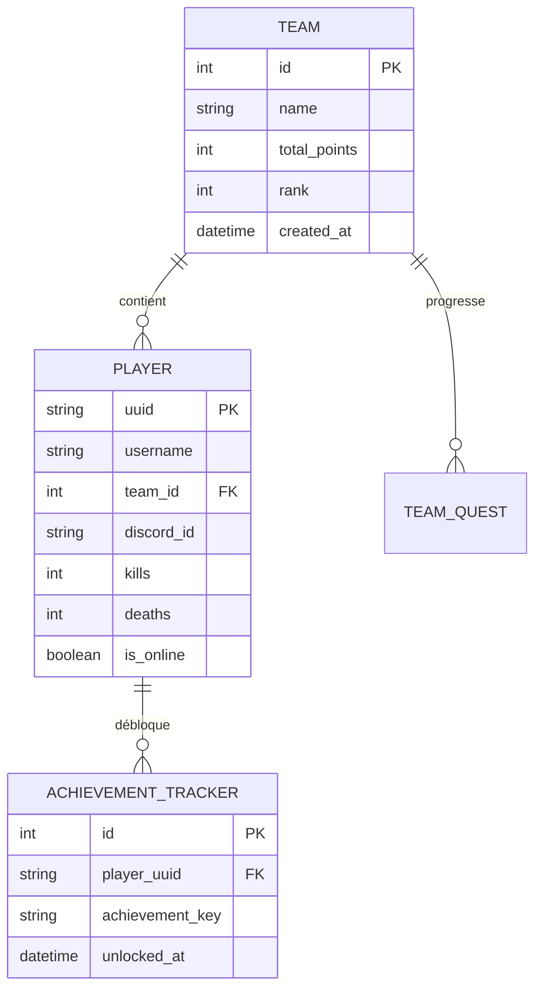

# Schéma de la Base de Données

L'écosystème **3LEvent** s'appuie sur une base de données relationnelle (MariaDB/MySQL) pour la persistance à long terme et sur une instance Redis pour la gestion des données volatiles en temps réel.

---

## 1. Conventions de Structure

* **Nomenclature** : Toutes les tables sont préfixées par `le3_` pour isoler les données de l'événement.
* **Format des colonnes** : Utilisation exclusive du `snake_case` (ex: `player_uuid`).
* **Identifiants** : Les joueurs sont indexés par leur `UUID` (String 36 chars). Les index sont obligatoires sur toutes les clés étrangères (FK).
* **Encodage** : `utf8mb4_unicode_ci` pour assurer le support des caractères spéciaux et des pseudos complexes.

---

## 2. Diagramme de Relation (ERD)

L'architecture est centrée sur la relation entre les joueurs et leurs équipes respectives.

---

## 3. Dictionnaire des Tables

### Table : le3_teams

Stocke les informations globales sur les équipes participantes.

| Colonne | Type | Description |
| --- | --- | --- |
| `id` | INT (PK) | Identifiant numérique interne. |
| `name` | VARCHAR(32) | Nom d'affichage de l'équipe. |
| `total_points` | INT | Cumul des points (par défaut: 0). |
| `rank` | INT | Position actuelle calculée au classement. |
| `created_at` | DATETIME | Horodatage de création de l'entrée. |

### Table : le3_players

Table pivot liant l'identité Minecraft, Discord et les statistiques.

| Colonne | Type | Description |
| --- | --- | --- |
| `uuid` | VARCHAR(36) (PK) | UUID Mojang unique du joueur. |
| `username` | VARCHAR(16) | Dernier pseudonyme connu en jeu. |
| `team_id` | INT (FK) | Référence à `le3_teams.id`. |
| `discord_id` | VARCHAR(20) | Identifiant Discord (Snowflake) pour la synchronisation. |
| `kills` | INT | Nombre total de kills durant l'événement. |
| `is_online` | BOOLEAN | État de connexion actuel sur le réseau. |

---

## 4. Couche de Cache (Redis)

Redis est utilisé pour les opérations nécessitant une latence inférieure à 1ms et une haute fréquence d'écriture.

### Leaderboard Temps Réel

* **Structure** : Sorted Set (`ZSET`)
* **Clé** : `le3:scores:leaderboard`
* **Usage** : Permet de récupérer le classement des équipes instantanément via `ZREVRANGE`.

### Session Joueur

* **Structure** : Hash (`HASH`)
* **Clé** : `le3:player:{uuid}`
* **Champs** : `last_server`, `current_proxy`, `login_time`.

---

## 5. Maintenance et Intégrité

1. **Transactions** : Toute mise à jour de score impliquant plusieurs tables doit être encapsulée dans une transaction SQL pour éviter les désynchronisations.
2. **Backups** : Un dump compressé est généré toutes les 12 heures et stocké sur un bucket S3 isolé.
3. **Contraintes** : L'utilisation des `ON DELETE CASCADE` est proscrite ; nous privilégions les suppressions logiques (`deleted_at`) pour l'audit post-événement.

---

### Prochaines étapes

* **[Consulter le protocole de communication](./communication-protocol)**
* **[Voir les snippets de requêtes SQL](../guidelines/code-snippets)**