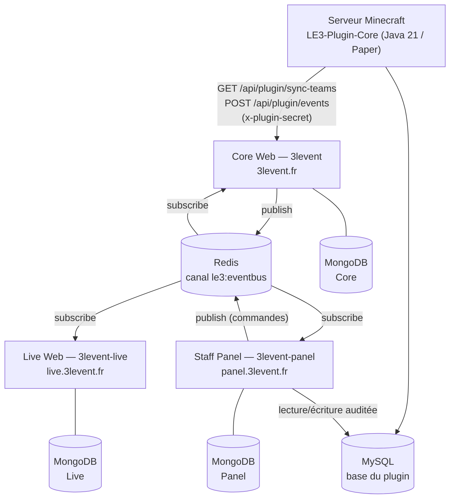

# Vue d'ensemble de l'écosystème

L'écosystème **3LEvent** est une suite de quatre services indépendants qui propulsent un
événement Minecraft compétitif : un serveur de jeu, un site public, un dashboard temps réel et un
panel d'administration staff.

---

## 1. Principe directeur : services découplés, bus partagé

Aucun service n'appelle directement la base de données d'un autre. Aucun service n'importe le code
d'un autre. La coordination passe par **un canal Redis Pub/Sub unique** (`le3:eventbus`) sur lequel
transitent des enveloppes JSON au format standardisé.

Conséquence pratique : ajouter un nouveau consommateur (le futur bot Discord, par exemple) ne
demande **aucune modification** des services existants — il lui suffit de s'abonner au canal.

:::note Le plugin ne parle pas directement à Redis
Le plugin Java n'embarque **aucun client Redis** (voir son `pom.xml`). Il publie sur le bus
*indirectement* : il envoie ses événements en HTTP à `POST /api/plugin/events` sur le Core, qui
valide le secret partagé puis relaie l'enveloppe sur `le3:eventbus`.
:::

---

## 2. Rôle de chaque service

### Core Web — dépôt `3levent`

Le site public et le point d'entrée de l'écosystème.

* Forum complet (catégories, threads, commentaires, recherche, modération).
* Portail d'inscription à l'événement (liaison Microsoft/Minecraft + Discord, OTP, équipes).
* Profils joueurs et liaison de comptes Discord / Twitch.
* Back-office `/admin` réservé aux rôles `STAFF` et `ADMIN`.
* **Passerelle du plugin** : c'est le seul service que le plugin Minecraft contacte.
* **Journal d'événements** : persiste chaque enveloppe du bus dans la collection `event_bus_events`.

### Live Web — dépôt `3levent-live`

Le dashboard temps réel destiné aux spectateurs.

* Classement des équipes, construit à partir d'un *read-model* local alimenté par le bus.
* Intégration Twitch (worker de synchronisation en tâche de fond).
* Système de pronostics des spectateurs.
* **Session partagée** avec le Core : même cookie `3levent.sid`, même préfixe Redis `le3:sess:`,
  domaine `.3levent.fr`. Un joueur connecté sur `3levent.fr` est connecté sur `live.3levent.fr`.

### Staff Panel — dépôt `3levent-panel`

L'outil interne du staff, derrière SSO Authentik.

* Monitoring serveur : métriques TPS/MSPT/CPU/RAM et console de logs en direct (SSE).
* Gestion in-game : répertoire des succès, attribution par équipe (commandes publiées sur le bus).
* Éditeur MySQL maison remplaçant phpMyAdmin, restreint à une liste blanche de tables et audité.
* IAM : rôles panel, groupes d'accès, annuaire du staff.
* CMS : configuration du site, mode maintenance par site, édition de `achievements.yml`.

### Plugin Core — dépôt `LE3-Plugin-Core`

Le noyau Java du serveur de jeu (Paper `1.21.11`, Java 21).

* Équipes en **lecture seule** : la composition vient du site via l'API, jamais l'inverse.
* Système de succès par équipe et par joueur, avec progression persistée en MySQL.
* Menus d'inventaire (succès, PNJ, équipe), notifications toast, placeholders.
* Intégrations optionnelles : Vault, LuckPerms, PlaceholderAPI, Citizens, MythicMobs.

---

## 3. Les trois canaux de communication

| Canal | Usage | Détail |
| :--- | :--- | :--- |
| **Redis Pub/Sub** | Toute coordination inter-services | [Protocoles de communication](./communication-protocol) |
| **HTTP + secret partagé** | Plugin → Core uniquement | En-tête `x-plugin-secret`, comparaison à temps constant |
| **Clés Redis partagées** | État global lu à chaud (maintenance) | `le3:maintenance:main`, `le3:maintenance:live` |

Le panel écrit les drapeaux de maintenance dans Redis ; le Core et le Live les lisent à chaque
requête via `createMaintenanceGuard`. Il n'y a aucun appel HTTP entre le panel et les sites publics.

---

## 4. Répartition des données

Chaque service possède sa propre base MongoDB. Aucune n'est partagée.

* **MongoDB Core** : utilisateurs, forum, inscriptions, équipes du site, journal du bus.
* **MongoDB Live** : *read-model* local (points d'équipe, compteurs de succès, réglages) + pronostics.
* **MongoDB Panel** : staff, rôles, logs serveur (capped), métriques (capped), config du site, audit BDD.
* **MySQL** : propriété du **plugin**, qui crée ses tables au démarrage. Le panel y accède en
  lecture/écriture auditée ; aucun autre service ne l'ouvre.
* **Redis** : sessions, bus d'événements, drapeaux de maintenance.

Détail des collections et des tables : [Schéma des données](./database-schema).

---

## 5. Philosophie de développement

### Duplication assumée du contrat

Le fichier `backend/events/ecosystem-event.ts` est **volontairement dupliqué** dans les trois
applications. Chaque service reste une unité déployable autonome ; en contrepartie, toute
modification du contrat doit être répercutée dans les trois copies et rester compatible sur le
fil. Les commentaires en tête de chaque copie le rappellent explicitement.

### Sécurité par défaut

* `helmet` avec CSP explicite, HSTS un an, `x-powered-by` désactivé sur les trois applications.
* Cookies `httpOnly`, `secure` en production, `sameSite: lax`.
* Le panel gate chaque page privée **côté serveur avant** `express.static`, pour qu'un HTML privé
  ne puisse jamais être servi à un visiteur non authentifié.
* Chaque route d'API du panel re-vérifie la permission via `requirePermission`, indépendamment de
  ce que masque la navigation côté client.

### Arrêt propre

Les trois serveurs interceptent `SIGINT` / `SIGTERM` et ferment explicitement le bus, le client
Redis de session et le pool MySQL avant de sortir.

---

## 6. Ce qui reste à faire

* **Bot Discord** : nom de service déjà réservé sur le bus, implémentation à démarrer.
* **Tests automatisés** : `npm test` renvoie encore une erreur sur les trois applications.
* **Publication du plugin sur le bus** : aujourd'hui via le relais HTTP du Core ; un client Redis
  natif côté Java supprimerait cette dépendance.

---

### Prochaines étapes

* **[Protocoles de communication](./communication-protocol)**
* **[Schéma des données](./database-schema)**
* **[Authentification et sessions](./authentication)**
