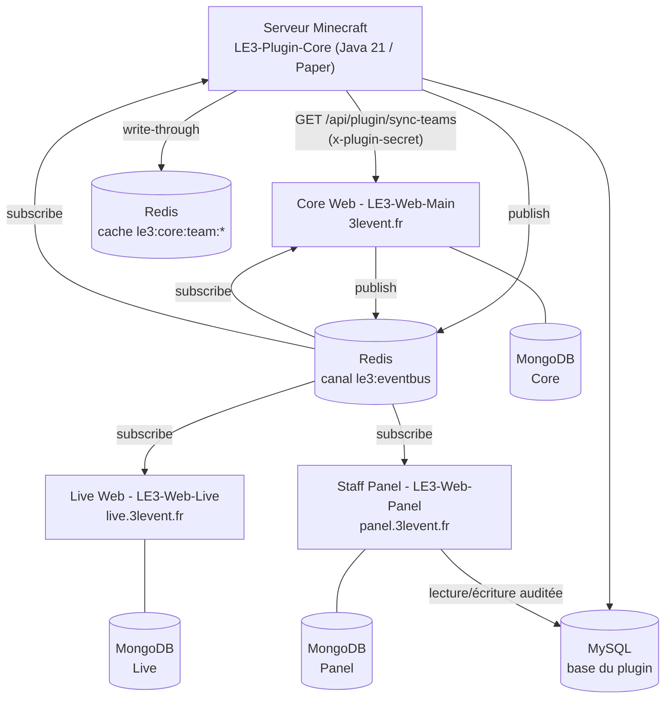

# Vue d'ensemble de l'écosystème

L'écosystème **3LEvent** est une suite de quatre services indépendants qui propulsent un
événement Minecraft compétitif : un serveur de jeu, un site public, un dashboard temps réel et un
panel d'administration staff.

---

## 1. Principe directeur : services découplés, bus partagé

Aucun service n'appelle directement la base de données d'un autre. Aucun service n'importe le code
d'un autre. La coordination passe par **un canal Redis Pub/Sub unique** (`le3:eventbus`) sur lequel
transitent des enveloppes JSON au format standardisé.

Conséquence pratique : ajouter un nouveau consommateur ne demande **aucune modification** des
services existants. Il lui suffit de s'abonner au canal, et les types qu'il ne connaît pas sont
ignorés sans erreur.

:::note[Le plugin publie directement sur Redis depuis le 2026-08-02]
Le plugin Java embarque désormais **Jedis** (shadé sous `fr.le3event.core.libs.jedis`) et parle à
Redis sans intermédiaire : il publie sur `le3:eventbus`, souscrit au même canal, et alimente le
cache partagé `le3:core:team:*`.

Le relais HTTP `POST /api/plugin/events` du Core existe toujours, mais le plugin ne l'utilise plus.
Il reste la seule voie possible pour un producteur sans accès direct à Redis.
:::

:::caution[Redis est optionnel côté plugin, obligatoire côté web]
Avec `redis.enabled: false` dans son `config.yml`, ou pendant une panne Redis, le plugin continue
de tourner sur MySQL seul : seules la vue temps réel du Panel et celle du Live sont perdues. Les
trois applications web, elles, ouvrent Redis au démarrage et ne démarrent pas sans lui.
:::

---

## 2. Rôle de chaque service

### Core Web - dépôt `LE3-Web-Main`

Le site public et le point d'entrée de l'écosystème.

* Forum complet (catégories, threads, commentaires, recherche, modération).
* Portail d'inscription à l'événement (liaison Microsoft/Minecraft + Discord, OTP, équipes).
* Profils joueurs et liaison de comptes Discord / Twitch.
* Back-office `/admin` réservé aux rôles `STAFF` et `ADMIN`.
* **Passerelle du plugin** : `GET /api/plugin/sync-teams` est la source de vérité des équipes.
* **Journal d'événements** : persiste chaque enveloppe du bus dans la collection `eventlogs`.

### Live Web - dépôt `LE3-Web-Live`

Le dashboard temps réel destiné aux spectateurs.

* Classement des équipes, construit à partir d'un *read-model* local alimenté par le bus.
* Intégration Twitch (worker de synchronisation en tâche de fond, API Helix).
* Système de pronostics des spectateurs, avec notification par webhook Discord.
* **Session partagée** avec le Core : même cookie `3levent.sid`, même préfixe Redis `le3:sess:`,
  domaine `.3levent.fr`. Un joueur connecté sur `3levent.fr` est connecté sur `live.3levent.fr`.

### Staff Panel - dépôt `LE3-Web-Panel`

L'outil interne du staff, derrière SSO Authentik.

* Monitoring serveur : métriques TPS/MSPT/CPU/RAM et console de logs en direct (SSE).
* Répertoire des succès en **lecture seule**, lu depuis `achievements.yml`.
* Éditeur MySQL maison remplaçant phpMyAdmin, restreint à une liste blanche de tables et audité.
* IAM : rôles panel, groupes d'accès, annuaire du staff.
* CMS : configuration du site, mode maintenance par site, édition de `achievements.yml`, liens de
  ressources, réglage des intégrations (`.env` éditables).

Le panel est un **consommateur pur** du bus : il ne publie aucun événement. Son seul canal
d'écriture vers les autres services est constitué des clés Redis `le3:maintenance:*`.

### Plugin Core - dépôt `LE3-Plugin-Core`

Le noyau Java du serveur de jeu (Paper `1.21.11`, Java 21).

* Équipes en **lecture seule** : la composition vient du site via l'API, jamais l'inverse.
* Système de succès par équipe et par joueur, avec progression persistée en MySQL.
* Menus d'inventaire (succès, PNJ), chat d'équipe, notifications toast, placeholders.
* Cache partagé et bus d'événements Redis, tous deux optionnels.
* Intégrations optionnelles : Vault, LuckPerms, PlaceholderAPI, Citizens, MythicMobs.

---

## 3. Les quatre canaux de communication

| Canal | Usage | Détail |
| :--- | :--- | :--- |
| **Redis Pub/Sub** | Toute coordination inter-services | [Protocoles de communication](./communication-protocol) |
| **HTTP + secret partagé** | Plugin → Core uniquement | En-tête `x-plugin-secret`, comparaison à temps constant |
| **Clés Redis partagées** | État global lu à chaud (maintenance) | `le3:maintenance:main`, `le3:maintenance:live` |
| **Cache Redis partagé** | État d'équipe lisible sans ouvrir MySQL | `le3:core:team:<slot>:progress`, `:points` |

Le panel écrit les drapeaux de maintenance dans Redis ; le Core et le Live les lisent à chaque
requête via `createMaintenanceGuard`. Il n'y a aucun appel HTTP entre le panel et les sites publics.

---

## 4. Répartition des données

Chaque service possède sa propre base MongoDB. Aucune n'est partagée.

* **MongoDB Core** : utilisateurs, forum, inscriptions, équipes du site, journal du bus.
* **MongoDB Live** : *read-model* local (points d'équipe, compteurs de succès, réglages) + pronostics.
* **MongoDB Panel** : staff, rôles, logs serveur (capped), métriques (capped), config du site, audit BDD.
* **MySQL** : propriété du **plugin**, qui crée ses tables au démarrage. Le panel y accède en
  lecture/écriture auditée ; aucun autre service ne l'ouvre.
* **Redis** : sessions, bus d'événements, drapeaux de maintenance, cache d'équipes.

Détail des collections et des tables : [Schéma des données](./database-schema).

---

## 5. Philosophie de développement

### Duplication assumée du contrat

Le fichier `backend/events/ecosystem-event.ts` est **volontairement dupliqué** dans les trois
applications, et porté en Java par `fr.le3event.core.redis.EcosystemEvent`. Chaque service reste
une unité déployable autonome ; en contrepartie, toute modification du contrat doit être
répercutée dans les quatre copies dans la même pull request, avec `CONTRACT_REVISION` incrémenté.
Un test de contrat (17 tests Vitest par application) rend l'écart visible en CI.

### Sécurité par défaut

* `helmet` avec CSP explicite, HSTS un an, `x-powered-by` désactivé sur les trois applications.
* Cookies `httpOnly`, `secure` en production, `sameSite: lax`.
* Le panel gate chaque page privée **côté serveur avant** `express.static`, pour qu'un HTML privé
  ne puisse jamais être servi à un visiteur non authentifié.
* Chaque route d'API du panel re-vérifie la permission via `requirePermission`, indépendamment de
  ce que masque la navigation côté client.

### Arrêt propre

Le Core et le Panel interceptent `SIGINT` / `SIGTERM` et ferment explicitement le bus, le client
Redis de session et le pool MySQL avant de sortir. Côté plugin, `onDisable` sauvegarde `data.yml`,
arrête le souscripteur Redis puis ferme les pools Redis et HikariCP.

---

### Prochaines étapes

* **[Protocoles de communication](./communication-protocol)**
* **[Schéma des données](./database-schema)**
* **[Authentification et sessions](./authentication)**
