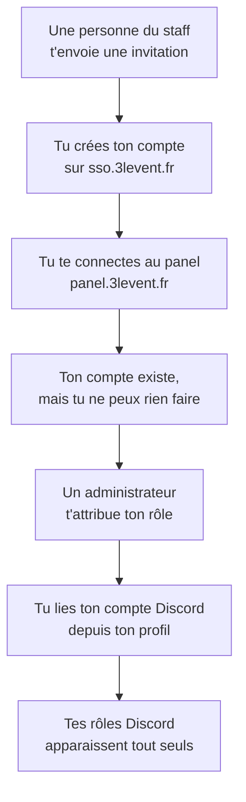

# Bienvenue dans 3LEvent

Cette page s'adresse à toi si tu viens de rejoindre l'équipe et que tu n'as **encore aucun
accès**. Elle ne suppose rien : ni compte, ni connaissance technique, ni outil installé.

Tu peux la lire entièrement sans être connecté à quoi que ce soit. C'est voulu, puisqu'au
moment où tu en as besoin, tu n'as encore accès à rien.

---

## 1. Comment ça se passe, en une image

Ton arrivée suit toujours le même enchaînement, quel que soit ton rôle. Chaque étape dépend de
la précédente : ce n'est pas une liste dans laquelle tu peux piocher.

L'étape 4 est celle qui surprend tout le monde, et elle est normale. Voir plus bas.

## 2. Ce dont tu as besoin avant de commencer

Trois choses, aucune n'est technique.

**Une adresse e-mail.** C'est elle qui recevra l'invitation, et elle deviendra l'identifiant de
ton compte. Choisis-en une que tu comptes garder.

**Un compte Discord.** Si tu n'en as pas, crée-le maintenant sur
[discord.com](https://discord.com) : tu en auras besoin à l'étape 6 et ça t'évitera de couper
ton installation en deux.

**Le nom de la personne qui t'a recruté.** C'est ton point de contact pour toute la durée de
l'arrivée. Si une étape bloque, c'est à elle que tu écris, pas à un support anonyme.

## 3. L'invitation, le seul point d'entrée

**Personne ne peut créer son compte seul.** Il n'y a pas de page d'inscription, et c'est
délibéré : l'accès au staff se donne, il ne se demande pas via un formulaire.

Tu recevras un **lien d'invitation à usage unique**, généralement par message privé Discord ou
par e-mail. Trois choses à savoir sur ce lien :

- Il ne fonctionne **qu'une seule fois**. Ne le partage avec personne, même pas avec un autre
  membre du staff qui attendrait le sien.
- Il **expire**. Si tu le laisses dormir plusieurs jours, il faudra en redemander un, ce qui
  n'est pas grave.
- S'il ne fonctionne plus, ce n'est pas une erreur de ta part. Redemande-le simplement.

## 4. Le moment où tu vas croire que ça a échoué

À ta première connexion au panel, ton compte est créé automatiquement, **sans aucun rôle et
sans aucune permission**.

Tu verras donc une interface presque vide, et la mention qu'aucun rôle ne t'est attribué. **Ce
n'est pas un bug, et tu n'as rien raté.** C'est une décision d'architecture : être authentifié
prouve qui tu es, pas ce que tu as le droit de faire. Les deux sont volontairement séparés.

Un administrateur doit t'attribuer ton rôle, et cela ne peut pas être automatique : personne
n'est censé décider seul de ses propres droits.

Ce que tu dois faire : **préviens ton contact que ta première connexion est faite.** Sans ce
signal, il ne sait pas que c'est à son tour d'agir. C'est la cause numéro un des arrivées qui
traînent une semaine.

## 5. La liaison Discord n'est pas un détail

Une fois ton rôle attribué, tu dois lier ton compte Discord depuis ton profil sur le panel.

Le principe à retenir : **c'est le panel qui décide de tes rôles Discord, jamais l'inverse.**
Tant que la liaison n'est pas faite, tu es sur le serveur Discord staff sans en avoir les
rôles, tu ne vois pas les salons de ton équipe, et le bot d'administration refuse toutes tes
commandes.

L'ordre compte : rôle sur le panel d'abord, liaison ensuite. Dans l'autre sens, la liaison
fonctionne mais ne te donne rien, puisqu'il n'y a aucun rôle à répercuter.

## 6. Choisis ton parcours

Les étapes détaillées dépendent de ce que tu viens faire.

| Tu arrives comme | Suis cette page | Compte y passer |
| :--- | :--- | :--- |
| Membre du staff, sans rôle technique | [Arrivée Staff](./staff) | 20 minutes |
| Développeur | [Arrivée Développeur](./developpeur) | 1 heure |
| Administrateur | [Arrivée Administrateur](./administrateur) | 1 heure |

Si tu hésites, prends la page Staff : elle est le socle des deux autres, qui la complètent
plutôt qu'elles ne la remplacent.

## 7. Si tu es bloqué

Reprends la page correspondant à ton parcours et **identifie la dernière étape qui a
fonctionné**. La quasi-totalité des blocages viennent d'une étape sautée, pas d'une panne.

Écris ensuite à ton contact en précisant cette étape. « Je suis bloqué » n'est pas
exploitable ; « ma première connexion au panel est passée mais je n'ai toujours aucun rôle »
se règle en une minute.
