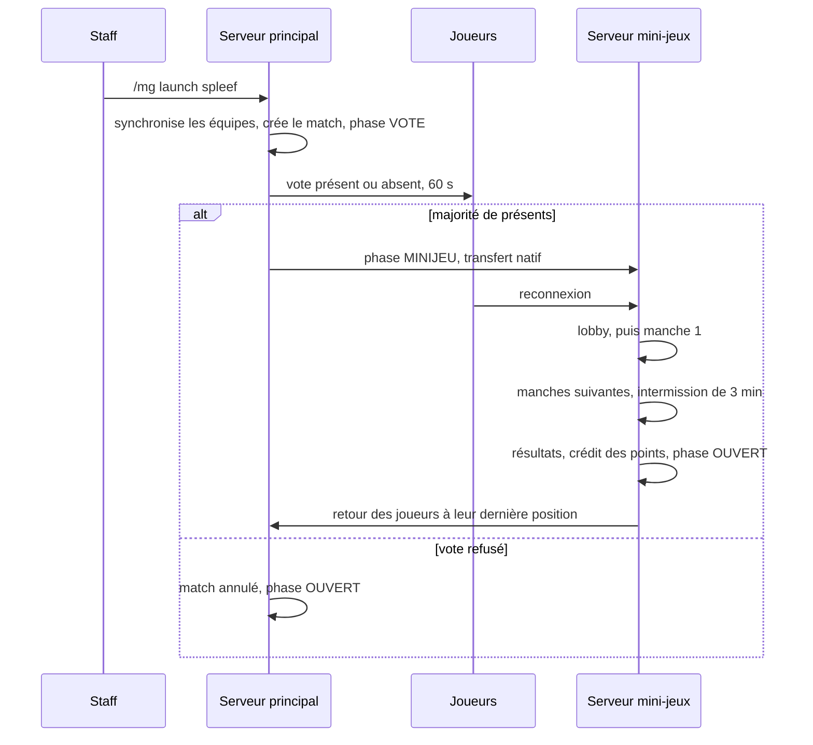

# Mini-jeux - `LE3-Plugin-Minigames`

La base des mini-jeux de l'événement. Elle porte le vote, le cycle d'un match, les manches, les
arènes générées et le crédit des points au classement général. Un jeu tient dans une classe de
définition, une classe de manche et un fichier YAML.

| | |
| :--- | :--- |
| **Dépôt** | `LE3-Plugin-Minigames` |
| **Dépend de** | `LE3-Plugin-Core` (équipes, points, stockage) et `LE3-Plugin-Event` (phase, réseau, kit) |
| **Contenu** | `LE3-Editions`, dossier `v6/minigames/` copié dans `plugins/LE3-Editions/` |
| **Serveurs** | Le lancement se fait depuis le principal, le match se joue sur le serveur mini-jeux |

---

## 1. Modules

| Module | Rôle |
| :--- | :--- |
| `minigames-rules` | Java pur : barème, normalisation, classement, positions de départ, décompte du vote, simulation |
| `minigames-api` | Ce que voit un auteur de jeu : `GameDefinition`, `RoundLogic`, `RoundContext`, `GameSpec`, `ArenaBuilder` |
| `minigames-toolkit` | Briques partagées entre jeux : disque à couches, rondes, outils de neige, chronomètre |
| `minigames-testkit` | Manche simulée, horloge virtuelle, joueurs fictifs : tester un jeu sans serveur |
| `minigames-engine` | Vote, match, manches, arènes, spectateurs, kits, placeholders, persistance, reprise, crédit |
| `games/<jeu>` | Un module Maven par jeu, découvert par `ServiceLoader` |
| `minigames-plugin` | Assemble le tout en `LE3MinigamesPlugin.jar` et porte les tests d'architecture |

La frontière entre un jeu et le moteur est garantie par le compilateur : un module de jeu ne
dépend pas du moteur, et un test ArchUnit le vérifie.

---

## 2. Déroulé d'un créneau

1. **Vote** : le staff lance un jeu de la sélection de l'édition. Chaque joueur d'une équipe
   répond présent ou absent. Un absent est spectateur pour tout le jeu et ne pénalise pas son
   équipe au-delà de l'effectif réduit.
2. **Lobby** : la manche 1 démarre dès que tout le monde est connecté, ou après 90 secondes.
   L'arène de la manche est construite pendant ce temps.
3. **Manche** : compte à rebours de 10 secondes, puis la durée du jeu, une escalade éventuelle à
   horaire fixe, et une mort subite si le jeu la demande. Une bossbar affiche le temps restant.
4. **Intermission** : 3 minutes entre deux manches, l'arène de la suivante se construit pendant
   ce temps. Les positions de départ tournent de trois crans : sur trois manches, aucune équipe
   ne joue deux fois la même zone.
5. **Résultats** : les points de manche sont cumulés, le classement final donne les points du
   barème, crédités une seule fois par match dans `point_awards`.

---

## 3. Équité

Les règles qui suivent valent pour tous les jeux, et le moteur les applique, pas les jeux.

* **Normalisation par l'effectif** : une équipe à 5 n'est pas désavantagée face à une équipe à 6.
  Chaque jeu déclare sa politique de mesure, le moteur ramène les mesures à un effectif de
  référence. Un simulateur vérifie qu'à niveau égal, les rangs moyens restent les mêmes.
* **Aucun point pour une élimination** : faire tomber un joueur ne rapporte rien, seul le fait de
  survivre compte.
* **Barème plafonné** : les mini-jeux ne dépassent jamais un quart du classement final. La table
  des points est figée au lancement de chaque match, donc une modification en cours d'événement
  ne réécrit pas le passé.
* **Équipes figées au début de chaque manche** : un retardataire entre à la manche suivante.
* **Abandon** : une équipe qui abandonne marque 0 sur la manche en cours et les suivantes ; les
  autres sont classées entre elles.

---

## 4. Commandes

| Commande | Serveur | Effet |
| :--- | :--- | :--- |
| `/mg launch <jeu>` | principal | Synchronise les équipes et ouvre le vote |
| `/vote present\|absent` | principal | Vote d'un joueur |
| `/mg vote force\|cancel` | principal | Termine ou annule le vote |
| `/mg start` | mini-jeux | Démarre la manche sans attendre |
| `/mg pause`, `/mg resume` | mini-jeux | Suspend et reprend les chronomètres |
| `/mg next-round` | mini-jeux | Termine la manche en cours |
| `/mg forfeit <équipe>` | mini-jeux | Abandon d'une équipe |
| `/mg ranking <équipes…>` | mini-jeux | Classement saisi à la main (jeu `manual`) |
| `/mg recover` | mini-jeux | Reprend un match après un redémarrage |
| `/mg cancel` | mini-jeux | Annule le match, sans crédit |
| `/mg adjust <équipe> <points> <raison>` | mini-jeux | Correction journalisée |
| `/mg validate` | les deux | Vérifie les fichiers de l'édition et liste les erreurs |
| `/mg status` | les deux | État du moteur, du match et du vote |

---

## 5. Les jeux livrés

| Jeu | État |
| :--- | :--- |
| `manual` | Le staff saisit le classement. Sert de secours pour un jeu qui ne serait pas prêt |
| `spleef` | Trois manches sur un disque de neige à couches : pelle, boules de neige, sol fissuré |
| `balls_of_steel` | On mine des sphères de minerai réparties en anneaux, on rapporte le butin sur la plateforme de son équipe. La trêve tient cinq minutes, le cœur de la carte s'ouvre plus tard. Un kill ne rapporte rien, le butin transporté tombe au sol |
| `territory` | On peint le sol en marchant et en tirant. La manche est notée sur la moyenne de la surface possédée, mesurée toutes les trente secondes, et non sur la surface finale |
| `pack` | Chaque équipe chasse une équipe et est chassée par une autre, tout le long de la manche. Les coups portés hors de sa paire ne font rien |
| `core` | Chaque équipe défend un noyau dans sa base et attaque ceux de deux adversaires, atteints par des portails. Les bases sont des copies : les portails décident qui affronte qui, pas la géographie |
| `rings` | Vol en élytres à travers des anneaux enfilés le long d'un tracé. Trois modes : contre-la-montre, chasse aux anneaux, relais aérien |
| `workshop` | Chaque équipe reproduit un modèle sur sa parcelle, avec une palette comptée. La note est la part des positions correctes, orientation comprise |
| `hunger_games` | Survie sur une carte construite, plan de loot fixe, bordure qui se referme. Un kill ne rapporte rien : ce qui compte est de rester debout |
| `seekers` | Une équipe traque, les sept autres se cachent déguisées en blocs. Huit manches courtes, pour que chaque équipe traque une fois |

Les neuf jeux du roster sont livrés, `manual` restant derrière eux. Quatre d'entre eux attendent du
contenu qui n'est pas du code : `hunger_games` et `seekers` veulent des cartes construites à la
main, `workshop` veut ses modèles. Une manche dont la carte ou le modèle manque n'a pas d'arène, et
le jeu le dit avec le nom qu'il a cherché. La sélection jouable d'une édition vit dans
`LE3-Editions/<édition>/minigames/selection.yml` : `/mg launch` refuse un jeu absent de cette liste.

### Ce que ces jeux ont en commun

Trois choix reviennent dans les trois nouveaux jeux, et méritent d'être connus avant d'en écrire un
quatrième.

- **Aucun jeu ne compense l'effectif lui-même**, sauf Territoire qui le fait sur la mesure parce
  que le pourcentage affiché aux joueurs doit être le score. Partout ailleurs, le jeu renvoie une
  mesure brute et le moteur applique la politique déclarée dans `GameSpec`.
- **Une escalade est une entrée de `timeline:`**, jamais un minuteur écrit dans le jeu. Le staff
  peut ainsi l'annoncer et une édition peut la déplacer sans toucher au code.
- **Ce qui doit être fermé est fermé par de la matière**, pas par une région protégée : le cœur de
  Balls Of Steel et le mur central de Territoire sont en bedrock, et la timeline le retire. Un
  joueur voit la différence depuis le terrain. Quand c'est tout le terrain qui se referme, c'est la
  bordure de monde vanilla, pour la même raison.

### Jouer sur une carte construite à la main

Un jeu qui ne peut pas générer son terrain demande une copie d'un monde construit :
`ArenaBuilder.template(nom)` pointe un dossier `le3_template_<nom>` posé à côté des mondes du
serveur, que le serveur ne charge jamais. Le moteur le copie hors du thread principal, joue dans la
copie, et supprime la copie à la fin de la manche. Le monde d'origine n'est jamais touché.

Deux fichiers ne sont pas copiés, `uid.dat` et `session.lock` : sans cela le serveur croirait que la
copie et l'original sont le même monde et refuserait de charger le second. Une copie qui échoue ne
bloque pas la soirée, la manche continue sans arène et la console dit pourquoi.

Pour préparer une carte : la construire dans un monde normal, arrêter le serveur, renommer son
dossier en `le3_template_<nom>`, et le retirer de la liste des mondes chargés.

---

## 6. Écrire un nouveau jeu

1. Copier `games/_template` en `games/<jeu>`, l'ajouter aux modules du parent et aux dépendances
   de `minigames-plugin`.
2. Remplir `GameSpec` : variantes des manches, politique de mesure, mode d'équipe, arène.
3. Assembler les briques du toolkit dans `build()` et `start()`, renvoyer la mesure brute dans
   `result()`.
4. Écrire `src/main/resources/games/<jeu>/game.yml` avec les valeurs par défaut, en n'utilisant
   que des clés de plateforme, jamais un nom de `Material`.
5. Ajouter au moins un test de mesure avec le testkit.
6. Ajouter le jeu à la sélection de l'édition et lui donner un nom dans son thème.

---

### Prochaines étapes

* **[Plugins Minecraft](./minecraft-plugins)**
* **[Protocoles de communication](../architecture/communication-protocol)**
